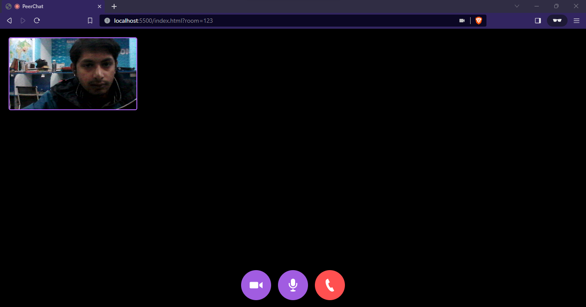

# PeerChat
A peer to peer WebRTC application with controls

# Installation
* 1 - clone repo https://github.com/VirtualDharm/PeerChat & https://github.com/VirtualDharm/mumble
* 2 - Create an account on agora.io and create an app to generate an APP ID
* 3 - Update APP ID, Temp Token and Channel Name in main.js
```javascript
let APP_ID = "YOU-APP-ID"
```

  

# Notes:
Peerchat: peer to peer calling with Room id using WEBRTC
MUMBLE: group video caling with (mesh: good until 4-5 connections, mcu(multicontrol unit): alot of bandwidth + sfu(selective forwarding unit) just act as a router)
* many participates
* chats
* Discord like multi vc on focus option with 3rd party service called agora.
* screen sharing
* display_name
* put on/off the focus the person or stream
* toggling audio/video

* WEBRTC: is a set of js API's that allow us to establish pear to pear connection b/w two broswers to exchange Audio/Video in real time.(real time/low latency). it is done for Audio/Video using UDP between broswers & data never touches server. No data validation. 

* WEBSOCKETS: better for chats/notification using tcp & communication is over the server. WebSockets + webRTC = Good.

* Signaling: is hand shaking(exchange of offer, answer 2 to 1, answer 1 to 2)
* SDP(session description protocol) of browser like (codec,mediatype,audio,video)
* ICE: public ip & port to send & receive data
* Stun Servers: give ICE values to us, we prefer google.stun.server it's cheap.

# code explaination for group vc
* building WebRTC applications, particularly focusing on creating a group video calling application using Agora:
* HTML Structure:
Define the webpage structure with HTML and CSS.
Include elements like a header bar displaying room information, a video grid for participants' feeds, and a chat sidebar.

* Lobby Page (lobby.html):
Handles initial login where users input their username and room name to join the video call.
Includes a button to initiate the call.

* Real-Time Communication (room_rtc.js):
Manages communication using the Agora WebRTC SDK.
Handles joining a room, creating local streams for audio and video, publishing local streams, and subscribing to remote streams.
Provides functionalities for muting audio/video, screen sharing, and leaving the call.

* Real-Time Messaging (room_rtm.js):
Manages real-time messaging using the Agora RTM SDK.
Connects to the Agora RTM service, listens for incoming messages, and displays them in the chat window.

* Code Snippets:

for building a group video calling application using Agora. Here are the key points:

Setting up the Agora SDK: Create an Agora client and initialize it with your Agora app ID and token.
Creating a channel: Create a virtual room where users can join the video call.
Joining a channel: Connect a user to the video call.
Publishing and subscribing to streams: Share video and audio with other participants.
Handling user events: Listen for events like users joining or leaving the call, and update the UI.
Screen sharing: Capture the user's screen and send it to other participants.
Real-time chat: Allow users to chat with each other during the video call.

* Joining a Room:
Initializes the Agora client with app ID and token.
Creates local streams for audio and video and publishes them to the room.
* Sharing Screens:
Allows users to share their screens with other participants.
* Sending Messages:
Enables real-time messaging functionality for participants to communicate via chat.
* Usage and Caution:
Utilize the provided code snippets carefully, ensuring they are adapted to your specific project needs.
Explore the source code for a deeper understanding of the application's functionalities.
* Further Exploration:
The provided code covers various aspects of building a video conferencing application.
Encourages users to delve into the source code for a comprehensive understanding of how everything integrates.

room.html:

This file defines the webpage structure using HTML and CSS.
It includes elements like:
A header bar displaying the room name and participants.
A video grid showcasing each participant's video feed.
A sidebar for chat functionality.
Controls for muting audio/video, screen sharing, and leaving the call.
lobby.html:

This file handles the initial login page where users:
Enter their username.
Specify a room name to join.
Click a button to join the video call.
room_rtc.js:

This file manages real-time communication using the Agora WebRTC SDK:
It defines functions for:
Joining a room:
Grabs the user's ID and token from the browser session storage.
Creates an Agora client object.
Initializes the client with the app ID and token.
Joins the specified room using the client object.
Managing streams:
Creates a local stream for the user's audio and video.
Publishes the local stream to the room, making it visible to other participants.
Subscribes to remote streams from other participants, displaying their video feeds in the video grid.
Sending messages:
Triggers the sendMessage function when the user types a message in the chat.
room_rtm.js:

This file handles real-time messaging using the Agora RTM SDK:
Connects to the Agora RTM service using the user ID and token.
Listens for incoming messages from other participants.
Displays received messages in the chat window.
Here are some code snippets illustrating these functionalities:

* Joining a room:
```javascript
function joinRoom() {
  const appId = "YOUR_APP_ID";
  const token = "YOUR_TOKEN";
  const username = sessionStorage.getItem("username");
  const roomName = sessionStorage.getItem("roomName");

  const client = AgoraRTC.createClient({ mode: "rtc", codec: "vp8" });
  client.on("joined-the-channel", handleChannelJoined);
  client.join(appId, token, roomName, username);
}

function handleChannelJoined(channel) {
  // Create a local stream for the user's audio and video
  const localStream = AgoraRTC.createStream({ video: true, audio: true });
  localStream.on("mic-mute", handleMicMute);
  localStream.on("camera-mute", handleCameraMute);
  // Publish the local stream to the room
  channel.publish(localStream);
  // Subscribe to remote streams from other participants
  channel.on("stream-added", handleStreamAdded);
  channel.on("stream-removed", handleStreamRemoved);
}
```
* Sharing screens:

```javascript
function shareScreen() {
  const screenStream = AgoraRTC.createScreenStream();
  screenStream.on("stopScreenSharing", handleScreenShareStop);
  channel.publish(screenStream);
  // Update UI to indicate screen sharing is active
}

function handleScreenShareStop() {
  // Stop the screen stream and update UI
  channel.unpublish(screenStream);
}
```
* Sending messages:

```javascript
function sendMessage(message) {
  client.getRTMClient().sendMessageToChannel(channel, message);
}
```